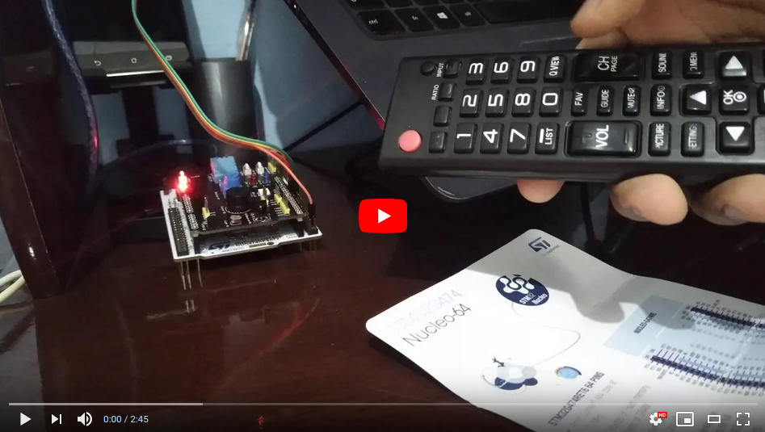
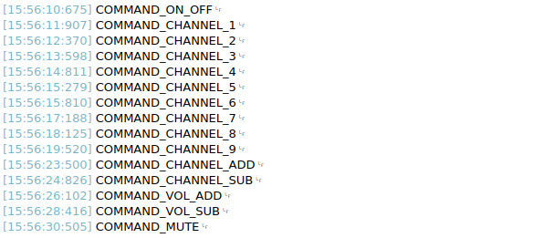
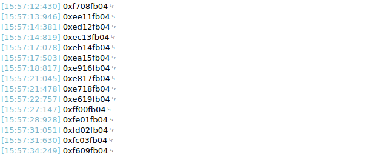

#	📡	My-STM32-IR-API

<div align="left">
    
    
    
</div>

---

This project aims to consolidate the lessons of the **UFMG "Embedded Systems Programming"** course about the development of microcontrollers APIs, in this case for **STM32** microcontrollers.

You can check this API working in the video below:

[](https://youtu.be/Hc2-oqp9iqE)

---

##	⚙️	Hardware
To test this API you will need a IR sensor. During the development we used a Multifunction Shield for Arduino, as a way to simplify the building and development. All the pins and components of the [shield](https://www.eletrogate.com/shield-multifuncoes-para-arduino-com-sensores) used are listed on the image below:

<p align="center">
  
</p>

This API was developed using the [Kit SMT32 Nucleo-G474RE](https://www.st.com/en/microcontrollers-microprocessors/stm32g474re.html#overview), you can check all the characteristics of the kit on the avaliable link and all the pins on the image bellow:

<p align="center">
  
</p>

---

##	📶	IR Protocol

The developed API is based on the IR communication protocol named NEC. This protocol is one of the most commercially used, has low complexity, and, as expected, works with a carrier at the frequency of 38KHz. A command sends in this protocol follow this pattern:

- A pulse with 9ms of width follow by a space of 4.5ms indicates that a command will be sent (start bit of protocol)
- In sequence, 32 pulses, which compose 32 bits of length command, are sent, in the following way:
	- 8 bits corresponding to the address of the device
	- 8 bits corresponding to the address of the device with inverted logic
	- 8 bits corresponding to the command sent
	- 8 bits corresponding to the command sent with inverted logic
	- A pulse with 562.5µs length that indicates the command is finished
- A pulse with 562.5µs width followed by one space of 562.5µs width too indicates that was sent a bit 0
- A pulse with 562.5µs width followed by one space of 1.6875ms width too indicates that was sent a bit 1

An example of a signal containg a command using the protocol can be observed on the image below:

<p align="center">
  
</p>

If a command is sent repeatedly, maintaining the button pressed, the signal transmitted indicates a repetition of the command is represented on the image below and is composed by:


- A pulse with 9ms of width, indicates the beginning of a new command, but followed by a space of 2.25ms this time indicating a repetition of the previous command;
- A pulse with 562.5µs of width indicates the command is finished

<p align="center">
  
</p>

---

##	📨	API

### Defines

```c
#define TIMER_MULTIPLIER 10
```
- Defines a value of the time multiplier which should be applied when receiving a time counter. As the timer was configured so that each clock tick be 10µs this value should be equals to 10. 
```c
#define DELTA_TIME 200
```
- Defines a tolerance interval which each pulse from the command received can have and still be correctly identified.

### Variables

```c
TIM_HandleTypeDef * My_IR_Timer;
```
- Pointer to the struct that controls the timer.
```c
uint16_t My_IR_Pin;
```
- Variable that stores which pins the IR sensor is connected.
```c
GPIO_TypeDef * My_IR_PinPort;
```
- Pointer to the struct that represents the correspondent Port to the IR sensor pin.
```c
uint8_t My_IR_IsReceiving;
```
- Flag that indicates which command is been received.
```c
uint8_t My_IR_ReceivedNewCommand;
```
- Flag that indicates which command was received and handled by the API.
```c
uint32_t My_IR_Command;
```
- Variable that stores the command received.
```c
uint8_t My_IR_BitsReceived;
```
- Variable that monitors the number of bits from the command that was already received.
```c
uint32_t My_IR_ElapsedTimeHigh;
```
- Variable that stores the time in logic level High of a received pulse.
```c
uint32_t My_IR_ElapsedTimeLow;
```
- Variable that stores the time in logic level Low of a received pulse.
```c
uint8_t My_IR_ReadValue;
```
- Variable that stores the lab value received by the IR sensor (0 or 1), in order to handle only the rising and falling edge generated by him.
```c
uint8_t My_IR_AllowRepeatCommand;
```
- Flag which determines if the API will accept repeated signals or no.

### Functions

```c
void My_IR_Init(TIM_HandleTypeDef * htim, GPIO_TypeDef * group, uint16_t pin);
```
- This Function is responsible for initializing the flags of the API and for assigning the values of the external parameters used (Timer, GPIO Port, and Pin).
- This function receives as a parameter:
	- A pointer to the struct that controls the timer
	- A pointer correspondent to GPIO Port used by IR sensor
	- The value of the IR sensor Pin

```c
void My_IR_Listening();
```
- This function is responsible for monitoring the IR sensor pin and for identifying when a pulse is received. This function calculates the time spent in logic level High and Low for each pulse received and calls the function My_IR_IdentifyPulse() which identifies the received pulse. This function is responsible for managing the timer
```c
void My_IR_IdentifyPulse();
```
- This function is responsible for identifies, according to the duration of the pulse in logic level High or Low, which pulse of the NEC protocol was received(start code, repeat command code, bit 1, bit 0). The function calls internally one of the three following functions relying upon the value identified for the pulse: My_IR_StartCommandReceived(), My_IR_SameCommandReceived(), My_IR_SetBitReceived(0) ou My_IR_SetBitReceived(1).
```c
void My_IR_StartCommandReceived();
```
- This function is responsible for resetting the variables My_IR_BitsReceived, My_IR_Command e My_IR_ReceivedNewCommand when a pulse that indicates receiving of a new command is identified.
```c
void My_IR_SameCommandReceived();
```
- This function is reponsible for verify if the flag My_IR_AllowRepeatCommand enabled (default value: true)
```c
void My_IR_SetBitReceived(uint32_t bit);
```
- This function is responsible for adding a received bit and identify the correct position of the 32 bits command My_IR_Command, and for setting the flag My_IR_ReceivedNewCommand when all 32 bits of the command were received, and disable the flag My_IR_IsReceiving, identifying the command is already received. 
- This Function receives as a parameter:
	- The value of the received bit
```c
void My_IR_GetIrCommandInHex(char * hexCommand);
```
- This function is responsible for return a Hexadecimal value of the received command as a string.
- This function receives as a parameter:
	- The pointer for the string that will receive the command converted
```c
void My_IR_GetIrCommandText(char * command);
```
- This function is responsible for return an identifier of the command or a Hexadecimal if the command is unknown.
- This function receives as a parameter:
	- The pointer for the string that will receive the identifier of the converted
```c
void My_IR_SetAllowRepeatCommand(uint8_t allow);
```
- This function is responsible for setting the flag  My_IR_AllowRepeatCommand which enables or disables the receiving of repeated commands.
- This function receives as a parameter:
	- The value of the flag (0 or 1)
```c
void HAL_TIM_PeriodElapsedCallback(TIM_HandleTypeDef * htim);
```
- This callback function is called when we have a time out indicating that has passed 100ms, which happens when the receiving command is corrupted, therefore this function reset My_IR_IsReceiving, indicating that the command is no longer being received.
- This function receives as a parameter:
	- The timer struct that causes this call


### File MySTM32_LG_Commands.h

This file defines the values of the commands mapped for a controller for a TV AKB74475448 from LG, which are:
```c
#define LG_COMMAND_ON_OFF 0xf708fb04
#define LG_COMMAND_CHANNEL_0 0xef10fb04
#define LG_COMMAND_CHANNEL_1 0xee11fb04
#define LG_COMMAND_CHANNEL_2 0xed12fb04
#define LG_COMMAND_CHANNEL_3 0xec13fb04
#define LG_COMMAND_CHANNEL_4 0xeb14fb04
#define LG_COMMAND_CHANNEL_5 0xea15fb04
#define LG_COMMAND_CHANNEL_6 0xe916fb04
#define LG_COMMAND_CHANNEL_7 0xe817fb04
#define LG_COMMAND_CHANNEL_8 0xe718fb04
#define LG_COMMAND_CHANNEL_9 0xe619fb04
#define LG_COMMAND_CHANNEL_ADD 0xff00fb04
#define LG_COMMAND_CHANNEL_SUB 0xfe01fb04
#define LG_COMMAND_VOL_ADD 0xfd02fb04
#define LG_COMMAND_VOL_SUB 0xfc03fb04
#define LG_COMMAND_MUTE 0xf609fb04
```

---

##	📩	Examples

### Simple way

A simple way for testing this API on your NUCLEO-G474RE, using STCubeMX and SW4ST32 IDE is through the transmission of the command by serialPort (E.G. using USART1) to be able to control any serial communication application. To test this code, just add the following code inside the loop of the main function:

```c
My_IR_Listening();
		
if (My_IR_ReceivedNewCommand) {

	My_IR_GetIrCommandText(message);
	UART_TransmitMessage(message);
	My_IR_ReceivedNewCommand = 0;
}
```

After this, you need to declare the definition of the function UART_TransmitMessage, as below:

```c
static void UART_TransmitMessage(char *);

void UART_TransmitMessage(char * message) {
	
	char * newLineChar = "\n";
	strcat(message, newLineChar);
	HAL_UART_Transmit(&huart1, (uint8_t *) message, strlen(message), 1000);
}
```
So, when pressing the following buttons on the remote controller and in the same order below, you will have a return on serial monitor the following messages:
Assim, ao pressionar o seguintes botões no controle remoto e na ordem descrita abaixo, você terá como retorno no seu monitor de serial as seguintes mensagens:

- Sequence of Buttons: ON/OFF, Button 0, Button 1, Button 2, Button 3, Button 4, Button 5, Button 6, Button 7, Button 8, Button 9, Channel +, Channel -, Volume +, Volume -, Mute

<p align="center">
  
</p>

Another simple test would be to change the function My_IR_GetIrCommandText for My_IR_GetIrCommandInHex, receiving the hexadecimal values of the commands on de serial monitor:

```c
My_IR_Listening();
		
if (My_IR_ReceivedNewCommand) {

	My_IR_GetIrCommandInHex(message);
	UART_TransmitMessage(message);
	My_IR_ReceivedNewCommand = 0;
}
```

<p align="center">
  
</p>

###	Example of Application

The applications on the example folder of this API can be tested using STMCubeMX and SW4STM32 and basically simulates a system that has 3 channels, each one indicates by a LED in the following way:

- Channel 1: LED Red
- Channel 2: LED Green
- Channel 3: LED Blue

Each channel has an oscillation frequency associated  that can be controlled through the volume buttons on the remote controller:

- Button Volume + : Increase the frequency of the LED in 1Hz until the maximum value of 10Hz.
- Button Volume - : Decrease the frequency of the LED in 1Hz until the minimum value of 1Hz.

It is possible to alternate between channel pressing the button of channel  on the remote controller or pressing the correspondent number of one of the three channels:

- Button 1: Go to channel 1
- Button 2: Go to channel 2
- Button 3: Go to channel 3
- Button Channel + : Go to the next channel in a cyclical way
	- Ex: channel 1 -> 2, channel 2 -> channel 3, channel 3 -> channel -> 1, ...
- Button Channel - : Go to the previous channel in a cyclical way
	- Ex: channel 1 -> 3, channel 3 -> channel 2, channel 2 -> channel -> 1, ...

It is still possible to make the LED stop oscillating by pressing the mute button on the controller, this will make the LED to be disabled until you press the mute button again and the LED returns blinking at 1Hz.

To test this application was used an RGB LED present on the shield that was mentioned previously and each of these LED pins was associated with a channel PWM of one Timer (TIM3 CH2 -> R, TIM17 CH1 -> G e TIM4 CH1 -> B) where each one of them is configured with a Prescaler of 10000 and a Counter Period of 10000, so each period of 1s have 1 clock ticks of 1µs.

---

##	📖	References

- [NEC Protocol](https://techdocs.altium.com/display/FPGA/NEC+Infrared+Transmission+Protocol)

- [IR Remote Control for LG](https://funembedded.wordpress.com/2014/11/08/ir-remote-control-for-lg-conditioner-using-stm32f302-mcu-on-mbed-platform/)

- [Shield](https://wiki.keyestudio.com/Ks0183_keyestudio_Multi-purpose_Shield_V1)

- [SIRC Remote Protocol Example (Another Protocol)](https://www.instructables.com/SIRC-Remote-Control/)

