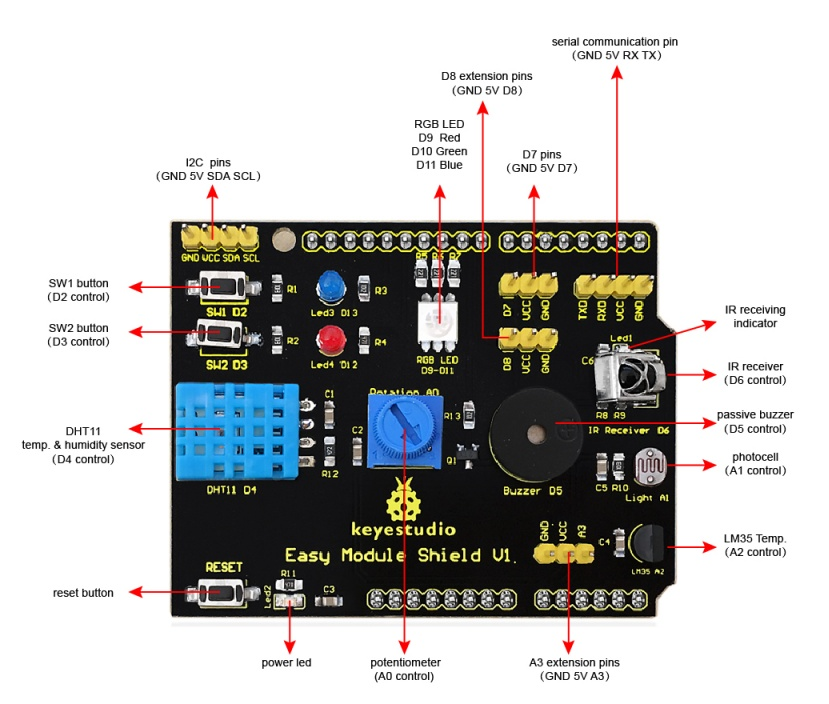
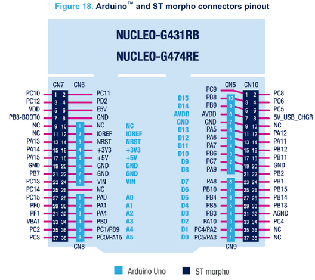
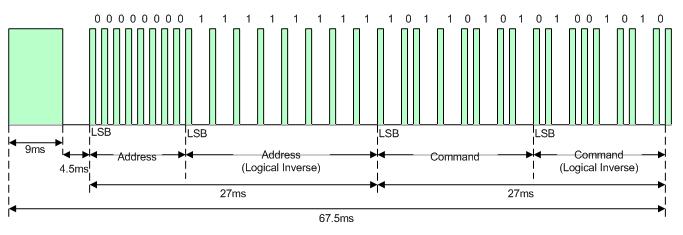
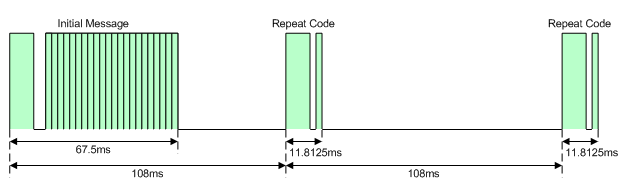

# My-STM32-IR-API
This project aims to consolidate the lessons of the UFMG "Embedded Systems Programming" course about the development of microcontrollers APIs, in this case for STM32 microcontrollers.

## Hardware
Para testar essa API você vai precisar de um sensor de IR. Durante o desenvolvimento utilizamos uma Shield Multifunções para Arduino, de forma a simplificar a montagem (inclusive o desenvolvimento da aplicação de exemplo). Os pinos e componentes da [shield](https://www.eletrogate.com/shield-multifuncoes-para-arduino-com-sensores) usada você pode ver na imagem abaixo:

<p align="center">
  
</p>

Essa API foi desenvolvida e testada para o [Kit SMT32 Nucleo-G474RE](https://www.st.com/en/microcontrollers-microprocessors/stm32g474re.html#overview) você pode conferir todas as características desse kit no link disponibilizado e os pinos na imagem imagem:

<p align="center">
  
</p>

## IR Protocol

A API desenvolvida é baseada em um protocolo de comunicação IR chamado NEC. Esse protocolo é um dos mais utilizados comercialmente e apresenta um baixo nível de complexidade e, como esperado, trabalha em cima de uma portadora com frequência de 38khz. Basicamente um comando enviado nesse protocolo segue o seguinte padrão:

- Um pulso de 9ms de largura seguido de um espaço de 4.5ms indica que um comando será enviado (bit de start do protocolo)
- Na sequência serão enviados 32 pulsos, que compõe um comando de 32 bits de comprimento organizados da seguinte forma:
	- 8 bits correspondentes ao endereço do dispositivo
	- 8 bits correspondentes ao endereço do dispositivo com a lógica invertida
	- 8 bits correspondentes ao comando enviado
	- 8 bits correspondentes ao comando enviado com a lógica invertida
	- Um pulso de 562.5µs que indica que o comando acabou
- Um pulso de 562.5µs seguido de um espaço de também 562.5µs indica o envio de um bit 0
- Um pulso de 562.5µs seguido de um espaço de 1.6875ms indica o recebimento de um bit 1

Um exemplo de um sinal contendo um comando usando esse protocolo pode ser observado na imagem abaixo:

<p align="center">
  
</p>

Além desses comando simples, caso o mesmo comando seja enviado repetidas vezes (por exemplo, mantendo o botão de um controle remoto pressionado), o sinal transmitido que indica a repetição do comando está representado na imagem abaixo e é composto por:

- Um pulso de 9ms, que indica o início de um novo comando, porém seguido por um espaço de apenas 2.25ms dessa vez, indicando que se trata de um comando repetido
- Um pulso de  562.5µs que indica que o comando acabou

<p align="center">
  
</p>

## API

### Defines

```c
#define TIMER_MULTIPLIER 10
```
- Define o valor do multiplicador de tempo que deve ser aplicado ao obter o valor do contador do timer. Como o timer foi configurado para que cada tick seja de 10µs essa constante é igual a 10
```c
#define DELTA_TIME 200
```
- Define um intervalo de tolerância que a duração de cada um dos pulsos do comando recebido pode ter e ainda ser identificado corretamente

### Variáveis

```c
TIM_HandleTypeDef * My_IR_Timer;
```
- Ponteiro para a estrutura que controla o timer
```c
uint16_t My_IR_Pin;
```
- Variável que armazena o pino que o sensor IR está conectado
```c
GPIO_TypeDef * My_IR_PinPort;
```
- Ponteiro para a estrutura que representa a porta correspondente ao pino do sensor IR
```c
uint8_t My_IR_IsReceiving;
```
- Flag que indica que um comando está sendo recebido
```c
uint8_t My_IR_ReceivedNewCommand;
```
- Flag que indica que um comando foi recebido e que pode ser tratado pela aplicação
```c
uint32_t My_IR_Command;
```
- Variável que armazena o comando recebido
```c
uint8_t My_IR_BitsReceived;
```
- Variável que monitora a quantidade de bits do comando já foram recebidos
```c
uint32_t My_IR_ElapsedTimeHigh;
```
- Variável que armazena o tempo em nível lógico alto do pulso recebido
```c
uint32_t My_IR_ElapsedTimeLow;
```
- Variável que armazena o tempo em nível lógico baixo do pulso recebido
```c
uint8_t My_IR_ReadValue;
```
- Variável que armazena o último valor recebido pelo sensor IR (0 ou 1) de forma a tratar apenas as bordas de subida e descida geradas por ele
```c
uint8_t My_IR_AllowRepeatCommand;
```
- Flag que determina se a API irá aceitar ou não o recebimento de sinais repetidos

### Funções

```c
void My_IR_Init(TIM_HandleTypeDef * htim, GPIO_TypeDef * group, uint16_t pin);
```
- Função responsável por inicializar as flags da API e por atribuir os valores dos parâmetros externos usados por ela (Timer, GPIO Port e Pin)
- Essa função recebe como parâmetros:
	-  um ponteiro para a estrutura que controla o timer
	- Um ponteiro para a estrutura que corresponde à porta GPIO do pino utilizado pelo sensor IR
	- O valor do pino do sensor IR
- Essa função não possui retorno

```c
void My_IR_Listening();
```
- Função responsável por monitorar o pino do sensor IR e por identificar quando um pulso foi recebido. Essa função calcula o tempo de nível lógico alto e baixo dos pulsos recebidos e chama a função My_IR_IdentifyPulse() que identifica o pulso recebido. Essa função é a responsável por gerenciar o timer
- Essa função não recebe parâmetros
- Essa função não possui retorno
```c
void My_IR_IdentifyPulse();
```
- Função responsável por identificar de acordo com a duração do pulso em nível lógico alto e baixo qual pulso do protocolo NEC foi recebido (start code, repeat command code, bit 1, bit 0). De acordo com o valor identificado para o pulso essa função chama internamente uma das três funções a seguir: My_IR_StartCommandReceived(), My_IR_SameCommandReceived(), My_IR_SetBitReceived(0) ou My_IR_SetBitReceived(1)
- Essa função não recebe parâmetros
- Essa função não possui retorno
```c
void My_IR_StartCommandReceived();
```
- Função responsável por resetar as variáveis My_IR_BitsReceived, My_IR_Command e My_IR_ReceivedNewCommand quando o pulso que indica o recebimento de um novo comando é identificado
- Essa função não recebe parâmetros
- Essa função não possui retorno
```c
void My_IR_SameCommandReceived();
```
- Função responsável por verificar se a flag My_IR_AllowRepeatCommand está habilitada (por padrão ela é inicializada como true)
- Essa função não recebe parâmetros
- Essa função não possui retorno
```c
void My_IR_SetBitReceived(uint32_t bit);
```
- Função responsável por adicionar o bit recebido e identificado na posição correta do comando de 32 bits My_IR_Command, por setar a flag My_IR_ReceivedNewCommand quando todos os 32 bits do comando forem recebidos e desativar a flag My_IR_IsReceiving, identificando que o comando já foi recebido
- Essa função recebe como parâmetros:
	- O valor do bit recebido
- Essa função não possui retorno
```c
void My_IR_GetIrCommandInHex(char * hexCommand);
```
- Função responsável por retornar o valor em hexadecimal do comando recebido em forma de string
- Essa função recebe como parâmetros:
	- O ponteiro para a string que vai receber o comando convertido
- Essa função não possui retorno
```c
void My_IR_GetIrCommandText(char * command);
```
- Função responsável por retornar o identificador do comando recebido em forma de string ou o valor em hexadecimal do comando caso esse seja desconhecido
- Essa função recebe como parâmetros:
	- O ponteiro para a string que vai receber o identificador do convertido
- Essa função não possui retorno
```c
void My_IR_SetAllowRepeatCommand(uint8_t allow);
```
- Função responsável por setar a flag My_IR_AllowRepeatCommand que habilita o desabilita o recebimento de comandos repetidos
- Essa função recebe como parâmetros:
	- O valor de atribuição da flag (tipicamente 0 ou 1)
- Essa função não possui retorno
```c
void HAL_TIM_PeriodElapsedCallback(TIM_HandleTypeDef * htim);
```
- Função de callback chamada quanto o timer estoura indicando que se passaram 100ms, o que ocorre apenas se o recebimento do comando for comprometido, assim essa função reseta My_IR_IsReceiving, indicando que o comando não está mais sendo recebido
- Essa função recebe como parâmetros:
	- A estrutura do timer que provocou a chamada dessa callback
- Essa função não possui retorno

### Arquivo MySTM32_LG_Commands.h

Esse arquivo auxiliar da biblioteca define os valores dos comandos mapeados para o controle de televisão da AKB74475448 da LG, que são:

```c
#define LG_COMMAND_ON_OFF 0xf708fb04
#define LG_COMMAND_CHANNEL_0 0xef10fb04
#define LG_COMMAND_CHANNEL_1 0xee11fb04
#define LG_COMMAND_CHANNEL_2 0xed12fb04
#define LG_COMMAND_CHANNEL_3 0xec13fb04
#define LG_COMMAND_CHANNEL_4 0xeb14fb04
#define LG_COMMAND_CHANNEL_5 0xea15fb04
#define LG_COMMAND_CHANNEL_6 0xe916fb04
#define LG_COMMAND_CHANNEL_7 0xe817fb04
#define LG_COMMAND_CHANNEL_8 0xe718fb04
#define LG_COMMAND_CHANNEL_9 0xe619fb04
#define LG_COMMAND_CHANNEL_ADD 0xff00fb04
#define LG_COMMAND_CHANNEL_SUB 0xfe01fb04
#define LG_COMMAND_VOL_ADD 0xfd02fb04
#define LG_COMMAND_VOL_SUB 0xfc03fb04
#define LG_COMMAND_MUTE 0xf609fb04
```


